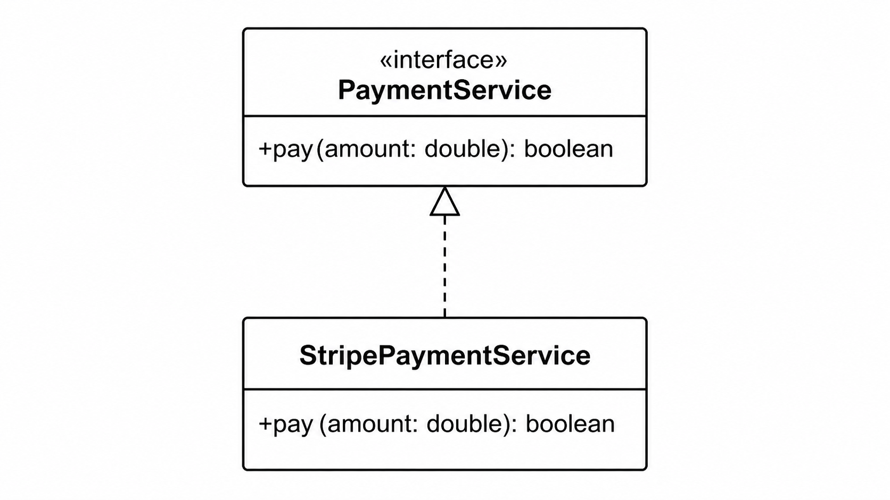

# Cours Java - Les interfaces

## 1) Définition
Une **interface** en Java définit un **contrat** :

- les méthodes qu'une classe doit fournir,
- sans imposer l'implémentation interne.

Une classe respecte ce contrat avec `implements`.

## 2) Pourquoi utiliser des interfaces
Les interfaces servent à :

- découpler le code (on dépend d'un contrat, pas d'une classe concrète),
- remplacer facilement une implémentation par une autre,
- faciliter les tests (on peut injecter un faux objet),
- appliquer SOLID (notamment OCP et DIP).

## 3) Syntaxe de base

```java
public interface PaymentService {
    boolean pay(double amount);
}
```

Implémentation :

```java
public class StripePaymentService implements PaymentService {
    @Override
    public boolean pay(double amount) {
        System.out.println("Paiement Stripe : " + amount);
        return true;
    }
}
```

Utilisation :

```java
public class CheckoutService {
    private final PaymentService paymentService;

    public CheckoutService(PaymentService paymentService) {
        this.paymentService = paymentService;
    }

    public void checkout(double total) {
        boolean ok = paymentService.pay(total);
        if (!ok) throw new IllegalStateException("Paiement refusé");
    }
}
```

## 4) Diagramme UML : interface et implémentation
Le lien entre une interface et une classe qui l'implémente est une relation de **réalisation** (ligne pointillée avec flèche triangulaire vide vers l'interface).

Illustration :




## 5) À quoi sert `@Override`
`@Override` indique qu'une méthode redéfinit bien une méthode déclarée dans une interface (ou une classe parente).

Pourquoi l'utiliser :
- le compilateur vérifie la signature exacte,
- évite les erreurs de frappe ou de type (`Double` au lieu de `double`),
- rend l'intention claire pour la lecture.

Exemple :

```java
public class StripePaymentService implements PaymentService {
    @Override
    public boolean pay(double amount) {
        return true;
    }
}
```

`@Override` n'est pas obligatoire, mais c'est une bonne pratique à appliquer systématiquement.

## 6) Idée clé : programmer contre une interface
Mauvaise approche :

```java
StripePaymentService payment = new StripePaymentService();
```

Bonne approche :

```java
PaymentService payment = new StripePaymentService();
```

Le code appelant dépend du **contrat** `PaymentService` et non du détail `StripePaymentService`.

## 7) Plusieurs implémentations

```java
public class PaypalPaymentService implements PaymentService {
    @Override
    public boolean pay(double amount) {
        System.out.println("Paiement PayPal : " + amount);
        return true;
    }
}
```

Aucun changement dans `CheckoutService`.
On remplace juste l'objet injecté.

## 8) Interface vs classe abstraite
Interface :

- définit principalement un contrat,
- supporte l'implémentation multiple (`implements A, B, C`),
- ne porte pas d'état métier.

Classe abstraite :

- partage du code commun,
- peut contenir de l'état (attributs),
- ne s'hérite qu'une seule fois (`extends`).

## 9) Bonnes pratiques

- nommer les interfaces par rôle (`PaymentService`, `Repository`, `Notifier`),
- garder des interfaces petites et cohérentes,
- éviter les interfaces “fourre-tout”,
- injecter les dépendances via le constructeur.

## 10) Erreurs fréquentes

- créer une interface sans besoin de variation,
- multiplier les méthodes non liées dans la même interface,
- typer partout avec des classes concrètes,
- confondre interface et classe utilitaire statique.

## 11) Exercice
Objectif : rendre un système de notifications extensible.

1. Créer `NotificationService` avec `void send(String message)`.
2. Implémenter `EmailNotificationService`.
3. Implémenter `SmsNotificationService`.
4. Créer `AlertManager` qui dépend de `NotificationService`.
5. Tester avec les deux implémentations sans modifier `AlertManager`.

## 12) Résumé
Une interface est un **contrat de comportement**.
Elle permet un code plus flexible, testable et évolutif.
La règle pratique : dépendre d'une interface quand plusieurs implémentations sont possibles aujourd'hui ou demain.
